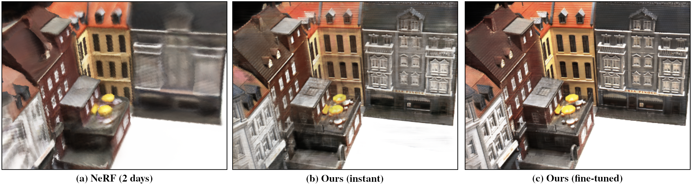

# Stereo Radiance Fields
> [Julian Chibane](http://virtualhumans.mpi-inf.mpg.de/people/Chibane.html), 
> [Aayush Bansal](http://www.cs.cmu.edu/~aayushb/),
> [Verica Lazova](http://virtualhumans.mpi-inf.mpg.de/people/Lazova.html),
> [Gerard Pons-Moll](http://virtualhumans.mpi-inf.mpg.de/people/pons-moll.html) <br />
> Stereo Radiance Fields (SRF): Learning View Synthesis for Sparse Views of Novel Scenes <br />
> In IEEE Conference on Computer Vision and Pattern Recognition (CVPR), 2021



[Paper](https://virtualhumans.mpi-inf.mpg.de/papers/chibane21SRF/chibane21srf.pdf) - 
[Supplementaty](https://virtualhumans.mpi-inf.mpg.de/papers/chibane21SRF/chibane21srf_supp.pdf) -
[Video](https://virtualhumans.mpi-inf.mpg.de/srf/#video) -
[Project Website](https://virtualhumans.mpi-inf.mpg.de/srf/) -
[Arxiv](https://arxiv.org/abs/2104.06935) -
If you find our project useful, please cite us. [Citation (Bibtex)](https://virtualhumans.mpi-inf.mpg.de/srf/#citation)

## Install
A linux system with python environment manager [conda](https://www.anaconda.com/) is required for the project.

The following commands clone the repo on your machine and install an environment, "srf", containing all dependencies. 
```
git clone https://github.com/jchibane/srf.git
cd SRF_git
conda env create -f srf_env.yml
```

### Data Setup
With the next commands the [DTU MVS dataset](https://roboimagedata.compute.dtu.dk/?page_id=36) is downloaded and put in place.
```
wget http://roboimagedata2.compute.dtu.dk/data/MVS/Rectified.zip -P data/
unzip data/Rectified.zip -d data/
mv data/Rectified/* data/DTU_MVS
rmdir data/Rectified
```

## Quick Start with Pretrained Model

To synthesise novel views of a pretrained and finetuned model use the following command
```
python generator.py --config configs/finetune_scan23.txt --generate_specific_samples scan23 --gen_pose 0
```

where `--gen_pose` is a camera pose of a video sequence from 0-55 (including both). 
We also provide a second model that can be used by switching both "23" to "106" in the previous command.

In order to do a 3D reconstruction please run:
```
python 3d_reconstruction.py --config configs/finetune_scan106.txt --generate_specific_samples scan106
```

> Note: The above configuration uses a batch of 250 rays to render at once, which assumes a ~48GB GPU.
> Consider adjusting this number in case of memory issues, by adding `--N_rays_test X`, with a suited number X to 
> previous command. Smaller batches will lead to increased generation time.
> 

## Training

Coming soon.


## Contact

For questions and comments please contact [Julian Chibane](http://virtualhumans.mpi-inf.mpg.de/people/Chibane.html) via mail.

## License
Copyright (c) 2021 Julian Chibane, Max-Planck-Gesellschaft

By downloading and using this code you agree to the terms in the LICENSE.

You agree to cite the `Stereo Radiance Fields (SRF): Learning View Synthesis for Sparse Views of Novel Scenes` paper in documents and papers that report on research using this software or the manuscript.


<details>
  <summary> Show LICENSE (click to expand) </summary>
Please read carefully the following terms and conditions and any accompanying documentation before you download and/or use this software and associated documentation files (the "Software").

The authors hereby grant you a non-exclusive, non-transferable, free of charge right to copy, modify, merge, publish, distribute, and sublicense the Software for the sole purpose of performing non-commercial scientific research, non-commercial education, or non-commercial artistic projects.

Any other use, in particular any use for commercial purposes, is prohibited. This includes, without limitation, incorporation in a commercial product, use in a commercial service, or production of other artefacts for commercial purposes.
For commercial inquiries, please see above contact information.

THE SOFTWARE IS PROVIDED "AS IS", WITHOUT WARRANTY OF ANY KIND, EXPRESS OR IMPLIED, INCLUDING BUT NOT LIMITED TO THE WARRANTIES OF MERCHANTABILITY, FITNESS FOR A PARTICULAR PURPOSE AND NONINFRINGEMENT. IN NO EVENT SHALL THE AUTHORS OR COPYRIGHT HOLDERS BE LIABLE FOR ANY CLAIM, DAMAGES OR OTHER LIABILITY, WHETHER IN AN ACTION OF CONTRACT, TORT OR OTHERWISE, ARISING FROM, OUT OF OR IN CONNECTION WITH THE SOFTWARE OR THE USE OR OTHER DEALINGS IN THE SOFTWARE.

You understand and agree that the authors are under no obligation to provide either maintenance services, update services, notices of latent defects, or corrections of defects with regard to the Software. The authors nevertheless reserve the right to update, modify, or discontinue the Software at any time.

The above copyright notice and this permission notice shall be included in all copies or substantial portions of the Software.

</details>

